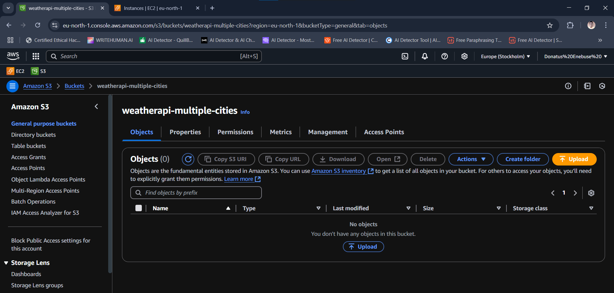
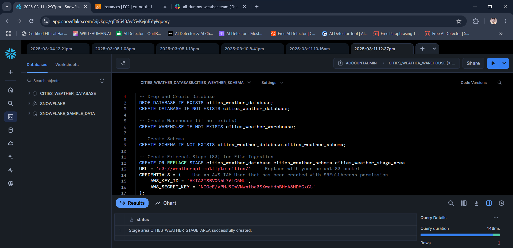
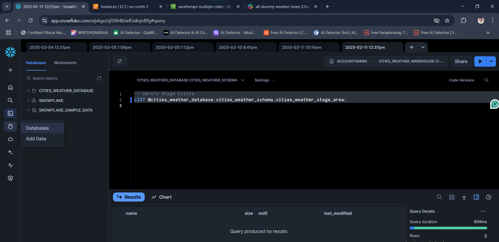
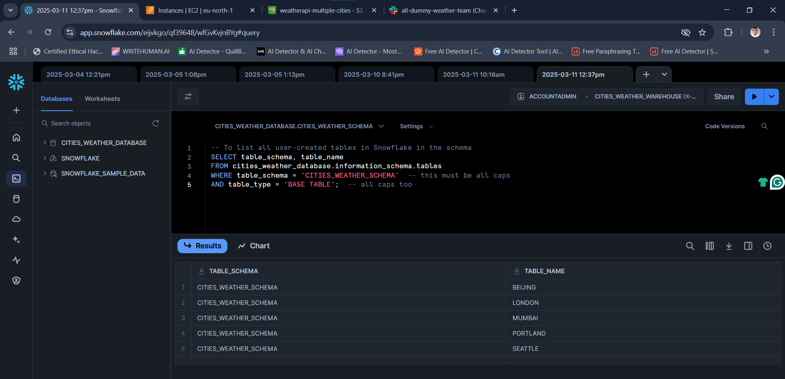
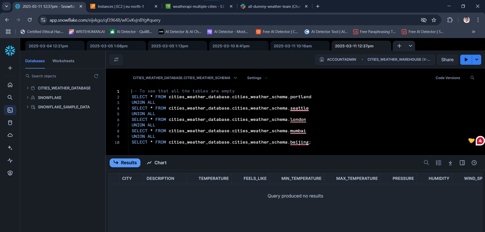
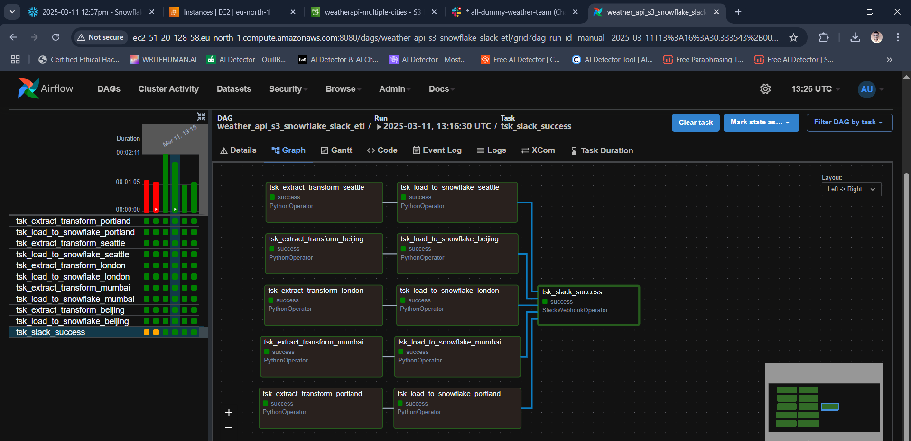
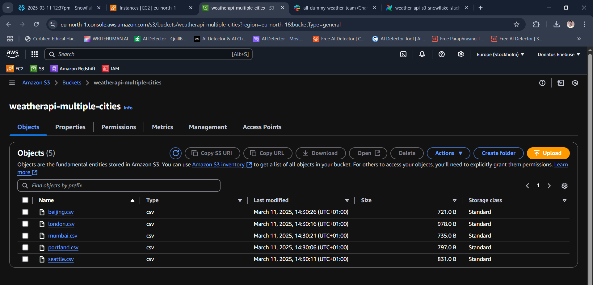
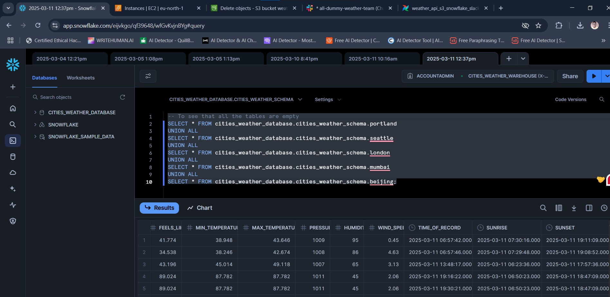
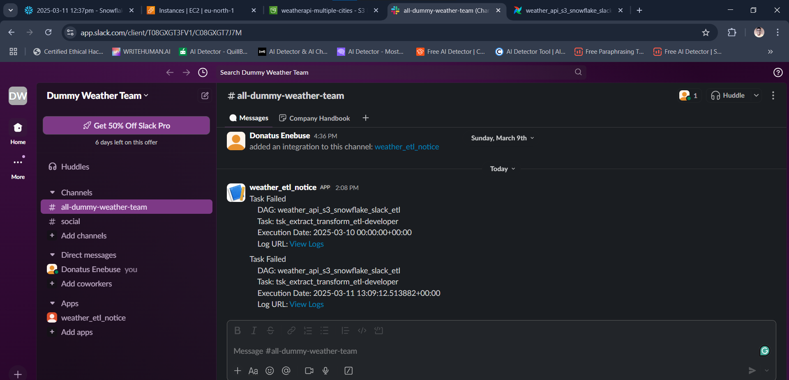
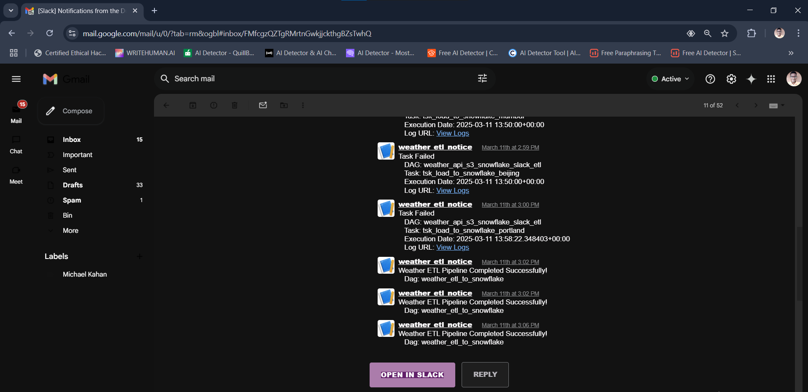

# OpenWeatherMap API to S3 bucket to Snowflake ETL Pipeline by Aiflow on EC2 with Slack notification
This is my second industry-level ETL project. This data pipeline orchestration uses Apache Airflow on AWS EC2. 

It demonstrates how to build an ETL data pipeline that would extract data (JSON) from the OpenWeatherMap API, transform it, dump it as CSV in S3 bucket, then copy it to destination tables in Snowflake DW and send Slack notification.
<br><br>

## GENERAL OVERVIEW OF PROJECT
This basic BI Engineering project which I did demonstrates the process of how to extract the current weather information for a list of 5 cities from the Open Weather Map (OWM) API (https://openweathermap.org/), used Python to perform data transformation, loaded the resulting data into an Amazon S3 bucket using Bash command and thereafter send out a Slack notification to a stakeholder channel. 

This ETL pipeline (workflow) was orchestrated and scheduled using Apache airflow running in an AWS EC2 instance.

Apache Airflow is an open-source platform used for orchestrating and scheduling workflows of tasks and data pipelines.

The project covers the fundamental concepts of Apache Airflow such as DAG (Directed Acyclic Graph) and Operators, and it shows how to schedule the ETL pipeline. 
It begins with extracting JSON format data from the API, and then transforming it into CSV format while applying some logic and calculations on the dataset. 
The orchestration proceeds to dump the CSV file into an S3 bucket data lake. 
The project then concludes by loading the data from the S3 bucket into corresponding tables in an already prepared Snowflake data warehouse.

The project exemplifies how to use the S3Hook to interact with CSV files present in an S3 bucket. 
In addition, it features how to create a stage area in Snowflake that points to an Amazon S3 bucket. 

The project goes on to demonstrate how to build and automate a data pipeline to load data from Amazon S3 bucket into a snowflake table and using the SlackWebhookOperator to send out an email notification to stakeholders when the data completed loading in the snowflake table using Airflow running in an AWS EC2 instance. 

Finally the orchestration would also send out Slack alerts to a designated channel whenever the DAG ultimately fails. 
This will indeed help a data team to stay proactive on what is happening on the data pipeline and fix issues as soon as they occur thereby helping to meet the Service Level Agreement (SLA).
<br><br>

## PROJECT REQUIREMENTS
1. Fundamental knowledge of SQL, Python, CSV/JSON, AWS Cloud, Apache Airflow, DW and ETL concepts
2. Snowflake free trial account (30 days free trial) for the Data Warehouse
3. OpenWeatherMap.ORG free account with API key (to serve as the data source)
4. Slack app set up on a Slack Workspace (this would be used by Airflow to send alerts)
5. AWS S3 bucket to serve as Data Lake, and IAM User for Snowflake that would have full access to S3 
6. AWS EC2 instance with at least 4 GB memory (t3.medium, non-free-tier) Ubuntu Linux 
7. Code Editor (I used VSCode) for connecting to EC2 instance to create code (DAG file) on Airflow
8. Apache Airflow for orchestration (authoring of the ETL workflow via DAG) & services connections
<br><br>

## STEPS OF THE WORKFLOW
The following account of the project development process is not enough to enable the reader to code along or replicate the whole process from start to finish. 
For instance, there is no detailing of the steps involved in creating accounts with Snowflake, OpenWeatherMap, and Amazon AWS. 
There is also no detailing of the steps in setting up the Slack app at https://api.slack.com/apps, creating the AWS EC2 instance from scratch and preparing it to work with Airflow (Firewall settings for HTTP/HTTPS/SSH and attaching the IAM Role), connecting VSCode to the EC2 instance, creating S3 bucket along with the IAM User, as well as accessing Airflow via web browser.

However an experienced and capable Data Engineer should be familiar with how these are set up, but the reader who is not knowledgeable in these areas is hereby encouraged to do their research, enroll in a Data Engineering boot camp or learn from data engineering tutorials available online on some websites or some great channels on YouTube, or reach out to me for clarification. 
With that out of the way, let’s go over the key steps in this project.

Having satisfied all the 8 requirements in the preceding section, I proceeded to carry out the following setup:
<br><br>

### STEP 1: Created the S3 Bucket, then created an IAM User and gave it S3FullAccess permission. Took note of the following relevant details:
* S3 bucket name
* The IAM User Access Key & Secret Access Key


<br><br>

### STEP 2: Set up Slack App and copied the necessary credentials:
* Slack Channel
* Slack Webhook URL
* Slack Webhook Endpoint (host)
* Webhook Token (Password)


<br><br>

### STEP 3: Prepared the Snowflake DW environment (Logged in to Snowflake > New Worksheet > SQL Worksheet)

#### a) Created the database, warehouse, schema, and stage area:
```
-- Drop and Create Database
DROP DATABASE IF EXISTS cities_weather_database;
CREATE DATABASE IF NOT EXISTS cities_weather_database;
-- Create Warehouse (if not exists)
CREATE WAREHOUSE IF NOT EXISTS cities_weather_warehouse;
-- Create Schema
CREATE SCHEMA IF NOT EXISTS cities_weather_database.cities_weather_schema;
-- Create External Stage (S3) for File Ingestion
CREATE OR REPLACE STAGE cities_weather_database.cities_weather_schema.cities_weather_stage_area 
URL = 's3://weatherapi-multiple-cities/'  -- Replace with your actual S3 bucket
CREDENTIALS = ( -- Used the AWS IAM User that has been created with S3FullAccess permission
    AWS_KEY_ID = 'AGPT8IKLPWR4J98GP9AQ',
    AWS_SECRET_KEY = 'FRAxL/xUZM5KcHYnjktp7AZrsDdkFVpT5DFKPpXn'
);
```


<br>

#### b) Checked for any issues before proceeding:
```
-- Verify Stage Exists
LIST @cities_weather_database.cities_weather_schema.cities_weather_stage_area;
```


<br>

#### c) Built the CSV file format for the schema:
```
-- Create File Format for CSV Data
CREATE OR REPLACE FILE FORMAT cities_weather_database.cities_weather_schema.csv_format
    TYPE = 'CSV'
    FIELD_DELIMITER = ','
    RECORD_DELIMITER = '\n'
    SKIP_HEADER = 1      -- if I wanted to map CSV headers to Table headers I would replace with PARSE_HEADERS = True
    FIELD_OPTIONALLY_ENCLOSED_BY='"';
```


<br>

#### d) Created each of the tables for the data warehouse:
```
-- The first City
CREATE OR REPLACE TABLE cities_weather_database.cities_weather_schema.portland (
    City STRING,
    Description STRING,
    Temperature FLOAT,
    Feels_Like FLOAT,
    Min_Temperature FLOAT,
    Max_Temperature FLOAT,
    Pressure INT,
    Humidity INT,
    Wind_Speed FLOAT,
    Time_of_Record TIMESTAMP,
    Sunrise TIMESTAMP,
    Sunset TIMESTAMP
);
-- The other Cities
CREATE OR REPLACE TABLE cities_weather_database.cities_weather_schema.seattle LIKE cities_weather_database.cities_weather_schema.portland;
CREATE OR REPLACE TABLE cities_weather_database.cities_weather_schema.london LIKE cities_weather_database.cities_weather_schema.portland;
CREATE OR REPLACE TABLE cities_weather_database.cities_weather_schema.mumbai LIKE cities_weather_database.cities_weather_schema.portland;
CREATE OR REPLACE TABLE cities_weather_database.cities_weather_schema.beijing LIKE cities_weather_database.cities_weather_schema.portland;
```


<br>

#### e) Verified that all is going well:
```
-- To list all user-created tables in Snowflake in the schema
SELECT table_schema, table_name
FROM cities_weather_database.information_schema.tables
WHERE table_schema = 'CITIES_WEATHER_SCHEMA'  -- this must be all caps 
AND table_type = 'BASE TABLE';  -- all caps too
```




<br><br>

### STEP 4: Prepared the computing environment (EC2) for Apache Airflow:
Note: Set up an EC2 to allow HTTP/HTTPS/SSH as well as Port 8080 for Airflow (could use an existing Security Group that does these)
Also had an IAM Role created that has S3FullAccess permission and attached it to the EC2 (Actions > Security > Modify IAM Role)


<br>

Then I proceeded to set up the EC2 instance by connecting to it via CLI and prepared it for Airflow using the following commands:

#### Update the system
```
sudo apt update && sudo apt upgrade –y
```

#### Install Python3 (needed for Airflow)
```
sudo apt install python3-pip
```
#### Check the version of Python that was installed before continuing.
```
python3 --version
```
#### Install Python3 Virtual Environment. I observed that the Python installed was 3.12, so I ran the command below
```
sudo apt install python3.12-venv
```
#### Set up or create the Python3 Virtual Environment for the project, and check if the venv directory was created
```
python3 -m venv cities_weather_airflow_s3_snowflake_slack_notif_venv
ls
```
#### Activate the Python3 Virtual Environment
```
source cities_weather_airflow_s3_snowflake_slack_notif_venv/bin/activate
```
#### Install Pandas for handling dataframe/CSV as well as Requests for handling HTTP calls to API
```
pip install pandas requests
```
#### Airflow base (also for DAG, airflow.models, and airflow.operators.python)
```
pip install apache-airflow
```
#### for BashOperator (which uses Linux CLI for running AWS COMMANDS as well as Jinja Templating)
```
pip install --upgrade awscli
```                
#### To allow Airflow to interact with AWS services, including S3, DynamoDB, Redshift, Lambda, etc (airflow.providers.amazon.aws.hooks.s3)
```
pip install apache-airflow-providers-amazon
```
#### For Snowflake (airflow.providers.snowflake.hooks.snowflake)
```
pip install apache-airflow-providers-snowflake
```
#### A helper package for Snowflake integration via Python connection
```
pip install snowflake-connector-python
```
#### for airflow.providers.slack.operators.slack_webhook
```
pip install apache-airflow-providers-slack
```
#### To run Airflow when needed (Ctrl+C to stop)
```
airflow standalone
```
<br><br>

### STEP 5: Set Up Airflow Connections (copied and run on Bash shell on the EC2)

#### a) Had to configure Airflow Connections for AWS, Snowflake, and Slack.

##### A. Configured Airflow AWS Connection
```
airflow connections add aws_new_conn \
    --conn-type aws \
    --conn-extra '{"region_name": "eu-north-1"}'
```

##### B. Configured Snowflake Connection
```
airflow connections add snowflake_new_conn \
    --conn-type snowflake \
    --conn-login weatherdatadw25 \
    --conn-password citiesDATAwarehouse \
    --conn-host eijvkgo-qf39648.snowflakecomputing.com \
    --conn-schema cities_weather_schema \
    --conn-extra '{"account": "EIJVKGO-QF39648", "database": "cities_weather_database", "warehouse": "cities_weather_warehouse", "role": "ACCOUNTADMIN"}'
```

##### C. Configured Airflow Slack Connection
```
airflow connections add slack_new_conn \
    --conn-type slackwebhook \
    --conn-host hooks.slack.com/services \
    --conn-password D98YUPR6HC9/Q89GT9SWP54/Wakjq82SAnFSmvXoYsptRD9B
```

#### b) Did some necessary checks to ensure that everything so far is working fine

##### Bash command to check if the last 3 connections were successfully added to Airflow
```
airflow connections list --output json | jq '.[-3:]'
```
##### Bash command to check if EC2 is able to have access to S3 (verifying the S3FullAccess IAM Role attached to EC2)
```
aws s3 ls s3://weatherapi-multiple-cities
```
<br><br> 

### STEP 6: I used these Bash commands to set important configuration values as variables (they would be called by the DAG orchestration file later on)
```
airflow variables set openweather_api_key "59250d7y8k082p9023ij683t478rnvxt"

airflow variables set slack_webhook_url "https://hooks.slack.com/services/D98YUPR6HC9/Q89GT9SWP54/Wakjq82SAnFSmvXoYsptRD9B"

airflow variables set iam_user_access_key "AGPT8IKLPWR4J98GP9AQ"

airflow variables set iam_user_secret_key "FRAxL/xUZM5KcHYnjktp7AZrsDdkFVpT5DFKPpXn"
```
<br><br>

### STEP 7: Authoring the orchestration DAG and testing:
The first step was to examine the JSON data received from the API endpoint when an HTTP call was made to it:
```
https://api.openweathermap.org/data/2.5/weather?q=portland&appid=59250d7y8k082p9023ij683t478rnvxt
```
 
```
{
  "coord": {
    "lon": -122.6762,
    "lat": 45.5234
  },
  "weather": [
    {
      "id": 804,
      "main": "Clouds",
      "description": "overcast clouds",
      "icon": "04d"
    }
  ],
  "base": "stations",
  "main": {
    "temp": 282.81,
    "feels_like": 281.9,
    "temp_min": 281.62,
    "temp_max": 284.05,
    "pressure": 1005,
    "humidity": 82,
    "sea_level": 1005,
    "grnd_level": 994
  },
  "visibility": 10000,
  "wind": {
    "speed": 2.06,
    "deg": 100
  },
  "clouds": {
    "all": 100
  },
  "dt": 1741725417,
  "sys": {
    "type": 2,
    "id": 2008548,
    "country": "US",
    "sunrise": 1741703416,
    "sunset": 1741745469
  },
  "timezone": -25200,
  "id": 5746545,
  "name": "Portland",
  "cod": 200
}
```
<br><br>

Building on experience and knowledge from my previous ETL project (see it here), I found the “extract from API” and “load to S3” tasks (as well as other tasks) to be pretty straightforward as they are based on how to use the relevant Operators in Airflow. This part was done by connecting my VS Code to the EC2 instance running Airflow then doing the coding of the DAG over there. 


<br> 

In between, I would test run the DAG via the web browser (and this requires stopping and restarting Airflow via the CLI). All aspects of the orchestration were tested, including the DAG run failure and retry. See the finished Airflow orchestration DAG Python file [here](code/cities_weather_etl.py).


<br><br>

### STEP 8: Triggering the DAG and observing the behaviors as well as debugging issues as seen from the task logs
Once the DAG was finished, I triggered the DAG via the Airflow UI on the web browser, and observed how the orchestration was successful. 


<br><br>

### STEP 9: Verifying the success of the ETL orchestration:
Upon the success of the orchestration, I verified the ETL process through the following:

#### 1) Checked the S3 bucket and its contents (they can also be listed via CLI)



<br>

#### 2) Queried the Snowflake data warehouse tables in one shot
```
-- To see that all the tables contain data
SELECT * FROM cities_weather_database.cities_weather_schema.portland
UNION ALL
SELECT * FROM cities_weather_database.cities_weather_schema.seattle
UNION ALL
SELECT * FROM cities_weather_database.cities_weather_schema.london
UNION ALL
SELECT * FROM cities_weather_database.cities_weather_schema.mumbai
UNION ALL
SELECT * FROM cities_weather_database.cities_weather_schema.beijing;
```



<br>

#### 3) Checked the Slack Channel via web browser





<br>

### STEP 10: Teardown and conclusion of demonstration:
Since this was for demonstration purposes, upon the success of the project the following were done as teardown: 

* Deactivate my OpenWeatherMap API key, stop my AWS EC2 instance, and clear the S3 bucket that was used in the project
* Deactivate the Slack app set up on my Slack Workspace that was used by Airflow for this project and elete the IAM User that I used for Snowflake

Note: The Snowflake credentials showed here are not real.
<br><br>

## CHALLENGES AND FINAL THOUGHTS:

1) Originally, I planned this project to make use of Google BigQuery. I felt that I could pick this up easily given my fundamental knowledge of Snowflake.
   However I ran into issues when trying to integrate BigQuery to AWS due to my limited knowledge.
   Then I switched to Amazon RedShift. I had some issues too due to my limited knowledge.
   Therefore, being somewhat comfortable with Snowflake, I chose to use it for this project.
   However in a future project, I might eventually find a way to use BigQuery or RedShift, especially BigQuery.

2) The first time the orchestration succeeded, the tables (in the data warehouse) lacked values for columns whose names in the CSV files had spaces.
   This was because these columns in the CSV files did not really "match" their corresponding columns in the DW tables (e.g. "Wind Speed" > "WIND_SPEED", case insensitive though).
   I later figured out that to get around this problem, I would have to specify the all columns in the correct order in the COPY INTO block, and also replaced PARSE_HEADERS=True with SKIP_HEADERS=1 in the CSV File Format of the Snowflake DW Schema.
   This would automatically map the columns irrespective of whether their column names totally match or not.

To wipe off incomplete data, I decided to clear the tables, and trigger the DAG again:
```
TRUNCATE TABLE cities_weather_database.cities_weather_schema.portland;
TRUNCATE TABLE cities_weather_database.cities_weather_schema.seattle;
TRUNCATE TABLE cities_weather_database.cities_weather_schema.london;
TRUNCATE TABLE cities_weather_database.cities_weather_schema.mumbai;
TRUNCATE TABLE cities_weather_database.cities_weather_schema.beijing;
```
<br> 

3) From project ideation, planning, development, testing, and deployment took me eight (4) working days because as a self-taught BI Developer, this was my second AWS Cloud Data Engineering project that is based on Airflow, EC2, S3, and Snowflake.
   The project could have taken me two or three days of not that I spent a good deal of time fiddling with BigQuery and RedShift.

#### Thank you for going through this project with me!
